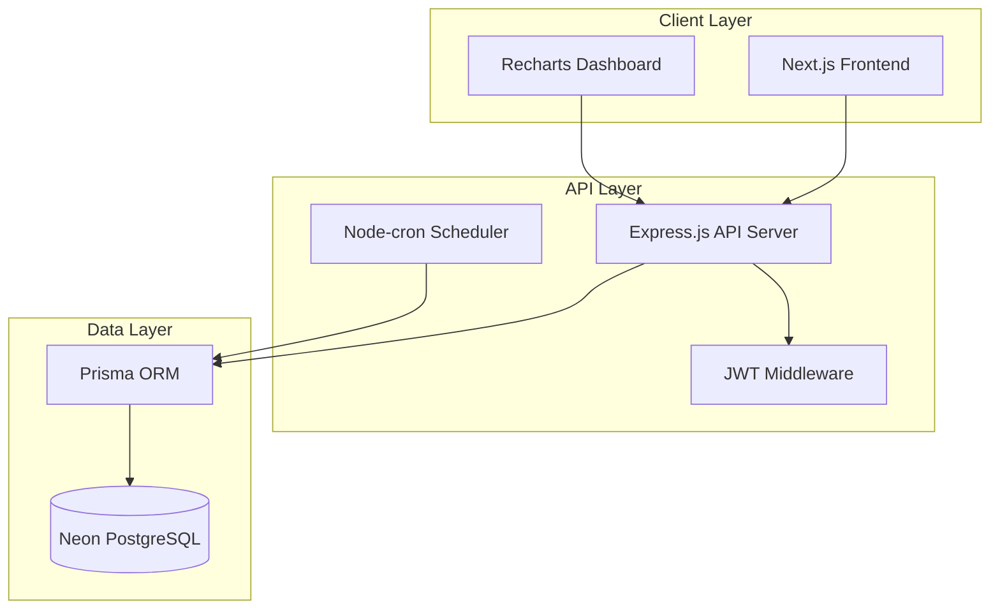
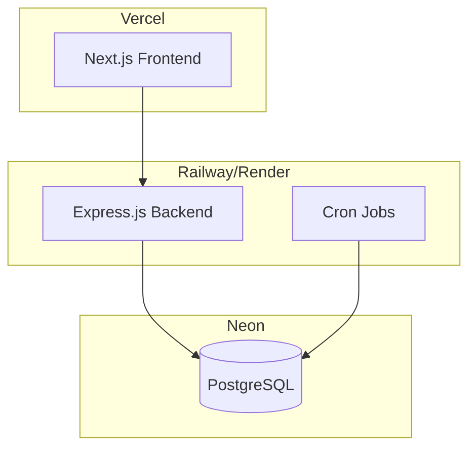

# Design Document - Hệ thống Quản lý Phòng cho thuê

## Overview

Hệ thống quản lý phòng cho thuê được thiết kế theo kiến trúc full-stack hiện đại với Next.js 14 (App Router), Express.js backend, Prisma ORM, và Neon PostgreSQL. Hệ thống áp dụng nguyên tắc separation of concerns với frontend và backend tách biệt, sử dụng RESTful API để giao tiếp.

### Tech Stack Summary
- **Frontend**: Next.js 14 (App Router), TypeScript, Tailwind CSS, Shadcn/ui, Zustand, TanStack Query
- **Backend**: Express.js, TypeScript, Prisma ORM, JWT Authentication, node-cron
- **Database**: Neon PostgreSQL
- **Charts**: Recharts
- **Deployment**: Vercel (Frontend), Railway/Render (Backend)

## Architecture

### High-Level Architecture



### Folder Structure

```
rental-management/
├── frontend/                 # Next.js Application
│   ├── app/                 # App Router
│   │   ├── (auth)/         # Auth group
│   │   ├── dashboard/      # Dashboard pages
│   │   ├── rooms/          # Room management
│   │   ├── tenants/        # Tenant management
│   │   ├── contracts/      # Contract management
│   │   ├── bills/          # Bill management
│   │   ├── settings/       # Settings management
│   │   └── api/            # API routes (if needed)
│   ├── components/         # Reusable components
│   │   ├── ui/            # Shadcn/ui components
│   │   ├── forms/         # Form components
│   │   ├── charts/        # Chart components
│   │   └── layout/        # Layout components
│   ├── lib/               # Utilities
│   ├── store/             # Zustand stores
│   └── types/             # TypeScript types
├── backend/                # Express.js API
│   ├── src/
│   │   ├── controllers/   # Route controllers
│   │   ├── middleware/    # Custom middleware
│   │   ├── routes/        # API routes
│   │   ├── services/      # Business logic
│   │   ├── jobs/          # Cron jobs
│   │   ├── utils/         # Utilities
│   │   └── types/         # TypeScript types
│   ├── prisma/            # Prisma schema & migrations
│   └── tests/             # Test files
└── shared/                 # Shared types/utilities
```

## Components and Interfaces

### Database Schema Design

```prisma
// Core Models
model Room {
  id          String   @id @default(cuid())
  number      String   @unique
  floor       Int
  area        Float
  type        String
  basePrice   Decimal
  status      RoomStatus @default(AVAILABLE)
  createdAt   DateTime @default(now())
  updatedAt   DateTime @updatedAt
  
  // Relations
  contracts   Contract[]
  bills       Bill[]
  meterReadings MeterReading[]
  
  @@map("rooms")
}

model Tenant {
  id          String   @id @default(cuid())
  fullName    String
  dateOfBirth DateTime
  idCard      String   @unique
  hometown    String
  phone       String
  createdAt   DateTime @default(now())
  updatedAt   DateTime @updatedAt
  
  // Relations
  contracts   ContractTenant[]
  residencyRecords ResidencyRecord[]
  
  @@map("tenants")
}

model Contract {
  id          String   @id @default(cuid())
  contractNumber String @unique
  roomId      String
  startDate   DateTime
  endDate     DateTime
  deposit     Decimal
  status      ContractStatus @default(ACTIVE)
  createdAt   DateTime @default(now())
  updatedAt   DateTime @updatedAt
  
  // Relations
  room        Room @relation(fields: [roomId], references: [id])
  tenants     ContractTenant[]
  bills       Bill[]
  
  @@map("contracts")
}

model ContractTenant {
  contractId  String
  tenantId    String
  isPrimary   Boolean @default(false)
  
  contract    Contract @relation(fields: [contractId], references: [id])
  tenant      Tenant @relation(fields: [tenantId], references: [id])
  
  @@id([contractId, tenantId])
  @@map("contract_tenants")
}

model Bill {
  id          String   @id @default(cuid())
  contractId  String
  roomId      String
  month       Int
  year        Int
  rentAmount  Decimal
  electricAmount Decimal
  waterAmount Decimal
  serviceAmount Decimal @default(0)
  totalAmount Decimal
  status      BillStatus @default(UNPAID)
  dueDate     DateTime
  paidDate    DateTime?
  createdAt   DateTime @default(now())
  updatedAt   DateTime @updatedAt
  
  // Relations
  contract    Contract @relation(fields: [contractId], references: [id])
  room        Room @relation(fields: [roomId], references: [id])
  
  @@unique([contractId, month, year])
  @@map("bills")
}

model MeterReading {
  id          String   @id @default(cuid())
  roomId      String
  month       Int
  year        Int
  electricReading Int
  waterReading Int
  createdAt   DateTime @default(now())
  
  // AI Scanning metadata (no images stored)
  electricScanConfidence Float?   // AI confidence for electric reading
  waterScanConfidence    Float?   // AI confidence for water reading
  isAiScanned           Boolean  @default(false)
  aiScanMetadata        Json?    // Store scan metadata only (timestamp, confidence, etc.)
  verifiedBy            String?  // User who verified AI reading
  verifiedAt            DateTime?
  
  room        Room @relation(fields: [roomId], references: [id])
  
  @@unique([roomId, month, year])
  @@map("meter_readings")
}

model ResidencyRecord {
  id          String   @id @default(cuid())
  tenantId    String
  type        ResidencyType
  startDate   DateTime
  endDate     DateTime?
  notes       String?
  createdAt   DateTime @default(now())
  
  tenant      Tenant @relation(fields: [tenantId], references: [id])
  
  @@map("residency_records")
}

model Settings {
  id          String   @id @default(cuid())
  category    String   // 'general', 'pricing', 'invoice', 'facility'
  key         String   
  value       String
  dataType    String   @default("string") // 'string', 'number', 'boolean', 'json'
  description String?
  updatedAt   DateTime @updatedAt
  
  @@unique([category, key])
  @@map("settings")
}

model User {
  id          String   @id @default(cuid())
  username    String   @unique
  password    String
  fullName    String
  role        UserRole @default(ADMIN)
  createdAt   DateTime @default(now())
  updatedAt   DateTime @updatedAt
  
  @@map("users")
}

// Enums
enum RoomStatus {
  AVAILABLE
  OCCUPIED
  RESERVED
  MAINTENANCE
}

enum ContractStatus {
  ACTIVE
  EXPIRED
  TERMINATED
}

enum BillStatus {
  UNPAID
  PAID
  OVERDUE
}

enum ResidencyType {
  TEMPORARY_RESIDENCE
  TEMPORARY_ABSENCE
}

enum UserRole {
  ADMIN
  MANAGER
}
```

### API Endpoints Design

```typescript
// Authentication
POST   /api/auth/login
POST   /api/auth/logout
GET    /api/auth/me

// Rooms
GET    /api/rooms                    # Get all rooms with filters (?page=1&limit=20&status=AVAILABLE)
POST   /api/rooms                    # Create new room
GET    /api/rooms/:id                # Get room details
PUT    /api/rooms/:id                # Update room
DELETE /api/rooms/:id                # Delete room
GET    /api/rooms/map                # Get room map data (no pagination)

// Tenants
GET    /api/tenants                  # Get all tenants with search (?page=1&limit=20&search=name)
POST   /api/tenants                  # Create new tenant
GET    /api/tenants/:id              # Get tenant details
PUT    /api/tenants/:id              # Update tenant
DELETE /api/tenants/:id              # Delete tenant
GET    /api/tenants/:id/history      # Get tenant rental history

// Contracts
GET    /api/contracts                # Get all contracts (?page=1&limit=20&status=ACTIVE)
POST   /api/contracts                # Create new contract
GET    /api/contracts/:id            # Get contract details
PUT    /api/contracts/:id            # Update contract
DELETE /api/contracts/:id            # Delete contract
POST   /api/contracts/:id/checkin    # Perform check-in
POST   /api/contracts/:id/checkout   # Perform check-out

// Bills
GET    /api/bills                    # Get bills with filters (?page=1&limit=20&status=UNPAID&month=12&year=2024)
POST   /api/bills                    # Create bill manually
GET    /api/bills/:id                # Get bill details
PUT    /api/bills/:id                # Update bill
DELETE /api/bills/:id                # Delete bill
POST   /api/bills/:id/pay            # Mark bill as paid
POST   /api/bills/generate           # Generate bills for month

// Meter Readings
GET    /api/meter-readings           # Get readings by month/year
POST   /api/meter-readings           # Submit meter readings
PUT    /api/meter-readings/:id       # Update reading
GET    /api/meter-readings/form      # Get form data for current month
POST   /api/meter-readings/ai-scan   # AI scan meter image
POST   /api/meter-readings/batch-scan # Batch AI scan multiple images

// Dashboard
GET    /api/dashboard/overview       # Get dashboard overview data
GET    /api/dashboard/revenue        # Get revenue chart data
GET    /api/dashboard/notifications  # Get notifications

// Settings
GET    /api/settings                 # Get all settings
PUT    /api/settings                 # Update settings
GET    /api/settings/categories      # Get settings by category
PUT    /api/settings/category/:name  # Update specific category
POST   /api/settings/logo            # Upload logo
DELETE /api/settings/logo            # Remove logo
```

### Settings Module Design

```typescript
// Settings Categories
interface SettingsCategories {
  general: {
    facilityName: string
    logo: string | null
    address: string
    phone: string
    email: string
    website?: string
    description?: string
  }
  
  pricing: {
    electricPrice: number        // VND per kWh
    waterPrice: number          // VND per m³
    internetFee: number         // Monthly internet fee
    cleaningFee: number         // Monthly cleaning fee
    securityFee: number         // Monthly security fee
    parkingFee: number          // Monthly parking fee
    garbageFee: number          // Monthly garbage fee
    managementFee: number       // Monthly management fee
  }
  
  facility: {
    gateOpenTime: string        // "06:00"
    gateCloseTime: string       // "22:00"
    wifiPassword: string
    emergencyContact: string
    rules: string[]             // Array of facility rules
    amenities: string[]         // Available amenities
  }
  
  invoice: {
    companyName: string
    taxCode: string
    bankAccount: string
    bankName: string
    invoiceTemplate: 'simple' | 'detailed' | 'custom'
    includeQRCode: boolean
    autoSendEmail: boolean
    invoicePrefix: string       // "HD", "INV", etc.
    invoiceNumberFormat: string // "YYYYMM-000"
  }
  
  notification: {
    reminderDaysBefore: number  // Days before due date to send reminder
    overdueReminderInterval: number // Days between overdue reminders
    contractExpiryReminder: number  // Days before contract expiry
    emailNotifications: boolean
    smsNotifications: boolean
  }
  
  ai: {
    geminiApiKey: string        // Encrypted Gemini API key
    enableAiScan: boolean       // Enable/disable AI scanning
    scanConfidence: number      // Minimum confidence threshold (0.8)
    maxImageSize: number        // Max image size in MB (5)
    supportedFormats: string[]  // ["jpg", "jpeg", "png", "webp"]
    autoFillReadings: boolean   // Auto-fill form after scan
    localStorageRetention: number // Days to keep images in localStorage (7)
  }
  
  system: {
    currency: string            // "VND"
    dateFormat: string          // "DD/MM/YYYY"
    timeFormat: string          // "24h" | "12h"
    language: string            // "vi" | "en"
    timezone: string            // "Asia/Ho_Chi_Minh"
    backupFrequency: string     // "daily" | "weekly" | "monthly"
  }
}

// Settings Service
class SettingsService {
  async getByCategory(category: keyof SettingsCategories) {
    return await prisma.settings.findMany({
      where: { category }
    })
  }
  
  async updateCategory(category: string, data: Record<string, any>) {
    const updates = Object.entries(data).map(([key, value]) => ({
      category,
      key,
      value: JSON.stringify(value),
      dataType: typeof value
    }))
    
    // Upsert all settings in category
    await Promise.all(
      updates.map(setting => 
        prisma.settings.upsert({
          where: { category_key: { category, key: setting.key } },
          create: setting,
          update: { value: setting.value, dataType: setting.dataType }
        })
      )
    )
  }
}
```

### AI Meter Reading Service

```typescript
// LocalStorage Manager for Images
class MeterImageStorage {
  private static readonly STORAGE_KEY = 'meter_images'
  private static readonly MAX_AGE_DAYS = 7
  
  static saveImage(roomId: string, meterType: 'electric' | 'water', imageFile: File): string {
    const imageId = `${roomId}_${meterType}_${Date.now()}`
    const reader = new FileReader()
    
    reader.onload = () => {
      const imageData = {
        id: imageId,
        roomId,
        meterType,
        data: reader.result as string,
        timestamp: Date.now(),
        fileName: imageFile.name,
        size: imageFile.size
      }
      
      this.storeImage(imageData)
      this.cleanupOldImages()
    }
    
    reader.readAsDataURL(imageFile)
    return imageId
  }
  
  static getImage(imageId: string): MeterImageData | null {
    const stored = localStorage.getItem(this.STORAGE_KEY)
    if (!stored) return null
    
    const images = JSON.parse(stored)
    return images[imageId] || null
  }
  
  static getImagesForRoom(roomId: string, month: number, year: number): MeterImageData[] {
    const stored = localStorage.getItem(this.STORAGE_KEY)
    if (!stored) return []
    
    const images = JSON.parse(stored)
    const monthStart = new Date(year, month - 1, 1).getTime()
    const monthEnd = new Date(year, month, 0).getTime()
    
    return Object.values(images).filter((img: any) => 
      img.roomId === roomId && 
      img.timestamp >= monthStart && 
      img.timestamp <= monthEnd
    )
  }
  
  private static storeImage(imageData: MeterImageData) {
    const stored = localStorage.getItem(this.STORAGE_KEY)
    const images = stored ? JSON.parse(stored) : {}
    
    images[imageData.id] = imageData
    localStorage.setItem(this.STORAGE_KEY, JSON.stringify(images))
  }
  
  private static cleanupOldImages() {
    const stored = localStorage.getItem(this.STORAGE_KEY)
    if (!stored) return
    
    const images = JSON.parse(stored)
    const cutoffTime = Date.now() - (this.MAX_AGE_DAYS * 24 * 60 * 60 * 1000)
    
    const cleanedImages = Object.fromEntries(
      Object.entries(images).filter(([_, img]: [string, any]) => 
        img.timestamp > cutoffTime
      )
    )
    
    localStorage.setItem(this.STORAGE_KEY, JSON.stringify(cleanedImages))
  }
}

// AI Service for Gemini API
class GeminiAIService {
  private apiKey: string
  private baseUrl = 'https://generativelanguage.googleapis.com/v1beta'
  
  constructor(apiKey: string) {
    this.apiKey = apiKey
  }
  
  async scanMeterImage(imageFile: File, meterType: 'electric' | 'water', roomId: string): Promise<MeterScanResult> {
    try {
      // Save image to localStorage first
      const imageId = MeterImageStorage.saveImage(roomId, meterType, imageFile)
      
      // Convert image to base64 for API call
      const base64Image = await this.fileToBase64(imageFile)
      
      const prompt = this.buildPrompt(meterType)
      
      const response = await fetch(`${this.baseUrl}/models/gemini-1.5-flash:generateContent`, {
        method: 'POST',
        headers: {
          'Content-Type': 'application/json',
          'x-goog-api-key': this.apiKey
        },
        body: JSON.stringify({
          contents: [{
            parts: [
              { text: prompt },
              {
                inline_data: {
                  mime_type: imageFile.type,
                  data: base64Image
                }
              }
            ]
          }],
          generationConfig: {
            temperature: 0.1, // Low temperature for accuracy
            maxOutputTokens: 100
          }
        })
      })
      
      const result = await response.json()
      const scanResult = this.parseAIResponse(result, meterType)
      
      // Add image reference to result
      scanResult.imageId = imageId
      
      return scanResult
      
    } catch (error) {
      throw new Error(`AI scan failed: ${error.message}`)
    }
  }
  
  private buildPrompt(meterType: 'electric' | 'water'): string {
    const prompts = {
      electric: `
        Analyze this electric meter image and extract the current reading.
        Look for the digital display or mechanical dials showing kilowatt-hours (kWh).
        Return only the numeric reading as a JSON object: {"reading": number, "confidence": 0.0-1.0}
        If you cannot clearly read the meter, return {"reading": null, "confidence": 0.0}
      `,
      water: `
        Analyze this water meter image and extract the current reading.
        Look for the digital display or mechanical dials showing cubic meters (m³).
        Return only the numeric reading as a JSON object: {"reading": number, "confidence": 0.0-1.0}
        If you cannot clearly read the meter, return {"reading": null, "confidence": 0.0}
      `
    }
    
    return prompts[meterType]
  }
  
  private parseAIResponse(response: any, meterType: string): MeterScanResult {
    try {
      const text = response.candidates[0]?.content?.parts[0]?.text
      const parsed = JSON.parse(text)
      
      return {
        reading: parsed.reading,
        confidence: parsed.confidence,
        meterType,
        rawResponse: response,
        timestamp: new Date()
      }
    } catch (error) {
      throw new Error('Failed to parse AI response')
    }
  }
  
  private async fileToBase64(file: File): Promise<string> {
    return new Promise((resolve, reject) => {
      const reader = new FileReader()
      reader.onload = () => {
        const base64 = reader.result as string
        resolve(base64.split(',')[1]) // Remove data:image/jpeg;base64, prefix
      }
      reader.onerror = reject
      reader.readAsDataURL(file)
    })
  }
}

// Types
interface MeterScanResult {
  reading: number | null
  confidence: number
  meterType: 'electric' | 'water'
  imageId: string // Reference to localStorage image
  rawResponse: any
  timestamp: Date
}

interface MeterImageData {
  id: string
  roomId: string
  meterType: 'electric' | 'water'
  data: string // base64 image data
  timestamp: number
  fileName: string
  size: number
}

interface MeterReadingWithAI extends MeterReading {
  electricScan?: MeterScanResult
  waterScan?: MeterScanResult
  storedImages?: MeterImageData[] // Images from localStorage
}
```

### AI-Enhanced Meter Reading Components

```typescript
// AI Camera Component
const AIMeterScanner = ({ 
  roomId, 
  meterType, 
  onScanComplete 
}: {
  roomId: string
  meterType: 'electric' | 'water'
  onScanComplete: (result: MeterScanResult) => void
}) => {
  const [isScanning, setIsScanning] = useState(false)
  const [preview, setPreview] = useState<string | null>(null)
  const fileInputRef = useRef<HTMLInputElement>(null)
  
  const scanMutation = useMutation({
    mutationFn: (file: File) => api.ai.scanMeter(file, meterType),
    onSuccess: (result) => {
      onScanComplete(result)
      setIsScanning(false)
    },
    onError: (error) => {
      toast.error(`Scan failed: ${error.message}`)
      setIsScanning(false)
    }
  })
  
  const handleImageCapture = (file: File) => {
    if (file) {
      setPreview(URL.createObjectURL(file))
      setIsScanning(true)
      scanMutation.mutate(file)
    }
  }
  
  return (
    <div className="space-y-4">
      {/* Camera/Upload Button */}
      <div className="flex flex-col sm:flex-row gap-2">
        <Button
          onClick={() => fileInputRef.current?.click()}
          disabled={isScanning}
          className="flex-1"
        >
          <CameraIcon className="w-4 h-4 mr-2" />
          {isScanning ? 'Đang quét...' : `Chụp đồng hồ ${meterType === 'electric' ? 'điện' : 'nước'}`}
        </Button>
        
        {/* Mobile: Use camera, Desktop: File upload */}
        <input
          ref={fileInputRef}
          type="file"
          accept="image/*"
          capture={isMobile ? "environment" : undefined}
          onChange={(e) => {
            const file = e.target.files?.[0]
            if (file) handleImageCapture(file)
          }}
          className="hidden"
        />
      </div>
      
      {/* Preview */}
      {preview && (
        <div className="relative">
          
          {isScanning && (
            <div className="absolute inset-0 bg-black bg-opacity-50 flex items-center justify-center rounded-lg">
              <div className="text-white text-center">
                <Spinner className="w-8 h-8 mx-auto mb-2" />
                <p>AI đang phân tích...</p>
              </div>
            </div>
          )}
        </div>
      )}
    </div>
  )
}

// Enhanced Meter Reading Form
const MeterReadingForm = ({ roomId, month, year }: MeterReadingFormProps) => {
  const [electricReading, setElectricReading] = useState('')
  const [waterReading, setWaterReading] = useState('')
  const [aiScans, setAiScans] = useState<{
    electric?: MeterScanResult
    water?: MeterScanResult
  }>({})
  
  // Load previously scanned images from localStorage
  useEffect(() => {
    const storedImages = MeterImageStorage.getImagesForRoom(roomId, month, year)
    
    // Check if we have recent scans for this room/month
    storedImages.forEach(img => {
      if (img.meterType === 'electric' && !aiScans.electric) {
        // Could show preview of previously scanned image
      }
    })
  }, [roomId, month, year])
  
  const handleAIScanComplete = (result: MeterScanResult) => {
    if (result.reading && result.confidence >= 0.8) {
      // Auto-fill if confidence is high
      if (result.meterType === 'electric') {
        setElectricReading(result.reading.toString())
      } else {
        setWaterReading(result.reading.toString())
      }
      
      setAiScans(prev => ({
        ...prev,
        [result.meterType]: result
      }))
      
      toast.success(`Đã quét thành công! Độ tin cậy: ${(result.confidence * 100).toFixed(1)}%`)
    } else {
      toast.warning('Không thể đọc rõ đồng hồ. Vui lòng nhập thủ công.')
    }
  }
  
  // Show scanned image preview from localStorage
  const showImagePreview = (meterType: 'electric' | 'water') => {
    const scan = aiScans[meterType]
    if (!scan?.imageId) return null
    
    const imageData = MeterImageStorage.getImage(scan.imageId)
    if (!imageData) return null
    
    return (
      <div className="mt-2">
         {
            // Show full size image in modal
            setImageModal({ open: true, src: imageData.data })
          }}
        />
        <p className="text-xs text-gray-500 mt-1">
          Đã quét lúc {new Date(imageData.timestamp).toLocaleTimeString()}
        </p>
      </div>
    )
  }
  
  return (
    <form className="space-y-6">
      {/* Electric Meter */}
      <div className="space-y-3">
        <label className="block text-sm font-medium">Chỉ số điện</label>
        
        <AIMeterScanner
          roomId={roomId}
          meterType="electric"
          onScanComplete={handleAIScanComplete}
        />
        
        <div className="flex items-center space-x-2">
          <input
            type="number"
            value={electricReading}
            onChange={(e) => setElectricReading(e.target.value)}
            className="flex-1 px-3 py-2 border rounded-md"
            placeholder="Nhập chỉ số điện"
          />
          {aiScans.electric && (
            <Badge variant={aiScans.electric.confidence >= 0.8 ? 'success' : 'warning'}>
              AI: {(aiScans.electric.confidence * 100).toFixed(0)}%
            </Badge>
          )}
        </div>
      </div>
      
      {/* Water Meter */}
      <div className="space-y-3">
        <label className="block text-sm font-medium">Chỉ số nước</label>
        
        <AIMeterScanner
          roomId={roomId}
          meterType="water"
          onScanComplete={handleAIScanComplete}
        />
        
        <div className="flex items-center space-x-2">
          <input
            type="number"
            value={waterReading}
            onChange={(e) => setWaterReading(e.target.value)}
            className="flex-1 px-3 py-2 border rounded-md"
            placeholder="Nhập chỉ số nước"
          />
          {aiScans.water && (
            <Badge variant={aiScans.water.confidence >= 0.8 ? 'success' : 'warning'}>
              AI: {(aiScans.water.confidence * 100).toFixed(0)}%
            </Badge>
          )}
        </div>
      </div>
      
      {/* Submit Button */}
      <Button type="submit" className="w-full">
        Lưu chỉ số
      </Button>
    </form>
  )
}
```

### Settings UI Components

```typescript
// Settings Page Structure
const SettingsPage = () => {
  const [activeTab, setActiveTab] = useState('general')
  
  return (
    <div className="settings-container">
      <SettingsTabs activeTab={activeTab} onTabChange={setActiveTab} />
      <SettingsContent tab={activeTab} />
    </div>
  )
}

// Individual Setting Components
const GeneralSettings = () => {
  const { data: settings, isLoading } = useQuery({
    queryKey: ['settings', 'general'],
    queryFn: () => api.settings.getByCategory('general')
  })
  
  const updateSettings = useMutation({
    mutationFn: (data: GeneralSettingsData) => 
      api.settings.updateCategory('general', data),
    onSuccess: () => {
      queryClient.invalidateQueries({ queryKey: ['settings'] })
      toast.success('Cài đặt đã được cập nhật')
    }
  })
  
  return (
    <SettingsForm
      data={settings}
      onSubmit={updateSettings.mutate}
      isLoading={isLoading || updateSettings.isPending}
    />
  )
}

// Logo Upload Component
const LogoUpload = () => {
  const uploadLogo = useMutation({
    mutationFn: (file: File) => api.settings.uploadLogo(file),
    onSuccess: () => {
      queryClient.invalidateQueries({ queryKey: ['settings', 'general'] })
    }
  })
  
  return (
    <div className="logo-upload">
      <input
        type="file"
        accept="image/*"
        onChange={(e) => {
          const file = e.target.files?.[0]
          if (file) uploadLogo.mutate(file)
        }}
      />
    </div>
  )
}
```

### Frontend Component Architecture

```typescript
// Store Structure (Zustand) - Simplified for UI state only
interface AppStore {
  // Auth
  user: User | null
  isAuthenticated: boolean
  login: (credentials: LoginCredentials) => Promise<void>
  logout: () => void
  
  // UI State
  selectedRoom: Room | null
  setSelectedRoom: (room: Room | null) => void
  sidebarOpen: boolean
  setSidebarOpen: (open: boolean) => void
}

// TanStack Query Hooks for Data Management

// Paginated Queries
const useRooms = (filters?: RoomFilters) => useQuery({
  queryKey: ['rooms', filters],
  queryFn: () => api.rooms.getAll(filters),
  staleTime: 5 * 60 * 1000, // 5 minutes
})

const useTenants = (filters?: TenantFilters) => useQuery({
  queryKey: ['tenants', filters],
  queryFn: () => api.tenants.getAll(filters),
  staleTime: 3 * 60 * 1000, // 3 minutes
})

// Infinite Queries for Mobile
const useInfiniteTenants = (search?: string) => useInfiniteQuery({
  queryKey: ['tenants', 'infinite', search],
  queryFn: ({ pageParam = 1 }) => 
    api.tenants.getAll({ page: pageParam, limit: 20, search }),
  getNextPageParam: (lastPage) => 
    lastPage.hasMore ? lastPage.page + 1 : undefined,
  staleTime: 3 * 60 * 1000,
})

const useInfiniteBills = (filters?: BillFilters) => useInfiniteQuery({
  queryKey: ['bills', 'infinite', filters],
  queryFn: ({ pageParam = 1 }) => 
    api.bills.getAll({ ...filters, page: pageParam, limit: 20 }),
  getNextPageParam: (lastPage) => 
    lastPage.hasMore ? lastPage.page + 1 : undefined,
  staleTime: 2 * 60 * 1000,
})

// Real-time Queries
const useRoomMap = () => useQuery({
  queryKey: ['rooms', 'map'],
  queryFn: () => api.rooms.getMap(),
  refetchInterval: 30 * 1000, // Auto-refresh every 30s
  staleTime: 30 * 1000, // Consider stale after 30s
})

const useDashboard = () => useQuery({
  queryKey: ['dashboard'],
  queryFn: () => api.dashboard.getOverview(),
  staleTime: 2 * 60 * 1000, // 2 minutes
  refetchInterval: 5 * 60 * 1000, // Refresh every 5 minutes
})

// Mutations with Optimistic Updates
const useUpdateRoomStatus = () => useMutation({
  mutationFn: ({ id, status }: { id: string, status: RoomStatus }) => 
    api.rooms.updateStatus(id, status),
  onMutate: async ({ id, status }) => {
    // Optimistic update
    await queryClient.cancelQueries({ queryKey: ['rooms'] })
    const previousRooms = queryClient.getQueryData(['rooms'])
    
    queryClient.setQueryData(['rooms'], (old: any) => ({
      ...old,
      data: old.data.map((room: Room) => 
        room.id === id ? { ...room, status } : room
      )
    }))
    
    return { previousRooms }
  },
  onError: (err, variables, context) => {
    // Rollback on error
    if (context?.previousRooms) {
      queryClient.setQueryData(['rooms'], context.previousRooms)
    }
  },
  onSettled: () => {
    queryClient.invalidateQueries({ queryKey: ['rooms'] })
    queryClient.invalidateQueries({ queryKey: ['dashboard'] })
  }
})

// Key Components
- RoomMap: Interactive grid with real-time status updates (responsive grid)
- BillGenerator: Form with optimistic updates (mobile-friendly)
- Dashboard: Auto-refreshing overview with charts (responsive charts)
- ContractForm: Multi-step form with validation (mobile wizard)
- TenantProfile: Detailed view with cached history (mobile cards)
- FooterNavigation: Mobile-only bottom navigation
- PullToRefresh: Mobile pull-to-refresh component
- InfiniteScroll: Mobile infinite scrolling lists
- ResponsiveTable: Desktop table / Mobile cards hybrid
```

## Data Models

### Core Entities Relationships

1. **Room ↔ Contract**: One-to-Many (một phòng có thể có nhiều hợp đồng theo thời gian)
2. **Contract ↔ Tenant**: Many-to-Many (một hợp đồng có thể có nhiều người thuê)
3. **Contract ↔ Bill**: One-to-Many (một hợp đồng tạo nhiều hóa đơn hàng tháng)
4. **Room ↔ MeterReading**: One-to-Many (một phòng có nhiều lần ghi chỉ số)
5. **Tenant ↔ ResidencyRecord**: One-to-Many (một người thuê có nhiều bản ghi tạm trú/tạm vắng)

### Business Rules

1. **Room Status Logic**:
   - AVAILABLE → RESERVED (khi tạo hợp đồng)
   - RESERVED → OCCUPIED (khi check-in)
   - OCCUPIED → AVAILABLE (khi check-out)
   - Any status → MAINTENANCE (khi cần sửa chữa)

2. **Bill Generation Logic**:
   - Chỉ tạo hóa đơn cho phòng có trạng thái OCCUPIED
   - Tính điện: (chỉ số mới - chỉ số cũ) × đơn giá điện
   - Tính nước: (chỉ số mới - chỉ số cũ) × đơn giá nước
   - Tổng tiền = tiền thuê + tiền điện + tiền nước + dịch vụ

3. **Contract Validation**:
   - Không thể tạo hợp đồng mới cho phòng đang OCCUPIED
   - Ngày kết thúc phải sau ngày bắt đầu
   - Tiền cọc phải >= 0

## Error Handling

### API Error Response Format

```typescript
interface ApiError {
  success: false
  error: {
    code: string
    message: string
    details?: any
  }
  timestamp: string
}

// Common Error Codes
enum ErrorCodes {
  VALIDATION_ERROR = 'VALIDATION_ERROR',
  NOT_FOUND = 'NOT_FOUND',
  UNAUTHORIZED = 'UNAUTHORIZED',
  FORBIDDEN = 'FORBIDDEN',
  CONFLICT = 'CONFLICT',
  INTERNAL_ERROR = 'INTERNAL_ERROR'
}
```

### Frontend Error Handling

```typescript
// Global error boundary
class ErrorBoundary extends Component {
  // Handle React errors
}

// API error handling
const apiClient = {
  async request(url: string, options: RequestInit) {
    try {
      const response = await fetch(url, options)
      if (!response.ok) {
        throw new ApiError(await response.json())
      }
      return response.json()
    } catch (error) {
      // Log error and show user-friendly message
      throw error
    }
  }
}
```

### Database Error Handling

```typescript
// Prisma error handling
const handlePrismaError = (error: any) => {
  if (error.code === 'P2002') {
    return new ConflictError('Duplicate entry')
  }
  if (error.code === 'P2025') {
    return new NotFoundError('Record not found')
  }
  return new InternalError('Database error')
}
```

## Testing Strategy

### Backend Testing

```typescript
// Unit Tests (Jest)
describe('BillService', () => {
  it('should calculate bill correctly', () => {
    // Test bill calculation logic
  })
  
  it('should handle invalid meter readings', () => {
    // Test error cases
  })
})

// Integration Tests
describe('Bills API', () => {
  it('should create bill with valid data', async () => {
    // Test API endpoints
  })
})

// Database Tests
describe('Bill Model', () => {
  it('should enforce unique constraint', async () => {
    // Test database constraints
  })
})
```

### Frontend Testing

```typescript
// Component Tests (React Testing Library)
describe('RoomMap', () => {
  it('should display rooms with correct colors', () => {
    // Test component rendering
  })
  
  it('should handle room click events', () => {
    // Test user interactions
  })
})

// Store Tests
describe('RoomStore', () => {
  it('should update room status', () => {
    // Test state management
  })
})

// E2E Tests (Playwright)
describe('Bill Generation Flow', () => {
  it('should generate bills from meter readings', async () => {
    // Test complete user flow
  })
})
```

### Automated Jobs Testing

```typescript
// Cron Job Tests
describe('Monthly Bill Generation', () => {
  it('should generate bills for all occupied rooms', async () => {
    // Mock date and test job execution
  })
  
  it('should handle errors gracefully', async () => {
    // Test error scenarios
  })
})
```

## Performance Considerations

### Database Optimization

1. **Indexing Strategy**:
   - Index on frequently queried fields (room.number, tenant.idCard, contract.contractNumber)
   - Composite indexes for bill queries (contractId, month, year)
   - Index on foreign keys for join performance

2. **Query Optimization**:
   - Use Prisma's `include` and `select` to fetch only needed data
   - Implement pagination for large datasets
   - Use database views for complex dashboard queries

### Responsive Design & Mobile-First Approach

```typescript
// Responsive Breakpoints (Tailwind CSS)
const breakpoints = {
  sm: '640px',   // Mobile landscape
  md: '768px',   // Tablet
  lg: '1024px',  // Desktop
  xl: '1280px',  // Large desktop
  '2xl': '1536px' // Extra large
}

// Layout Components
const Layout = ({ children }: { children: React.ReactNode }) => {
  return (
    <div className="min-h-screen bg-gray-50">
      {/* Desktop: Sidebar Navigation */}
      <div className="hidden lg:block">
        <DesktopSidebar />
      </div>
      
      {/* Mobile: Header */}
      <div className="lg:hidden">
        <MobileHeader />
      </div>
      
      {/* Main Content */}
      <main className="lg:ml-64 pb-16 lg:pb-0">
        <div className="px-4 sm:px-6 lg:px-8 py-4">
          {children}
        </div>
      </main>
      
      {/* Mobile: Footer Navigation */}
      <div className="lg:hidden">
        <FooterNavigation />
      </div>
    </div>
  )
}

// Footer Navigation for Mobile
const FooterNavigation = () => {
  const pathname = usePathname()
  
  const navItems = [
    { href: '/dashboard', icon: HomeIcon, label: 'Tổng quan' },
    { href: '/rooms', icon: BuildingIcon, label: 'Phòng' },
    { href: '/tenants', icon: UsersIcon, label: 'Khách thuê' },
    { href: '/bills', icon: DocumentIcon, label: 'Hóa đơn' },
    { href: '/settings', icon: CogIcon, label: 'Cài đặt' }
  ]
  
  return (
    <nav className="fixed bottom-0 left-0 right-0 bg-white border-t border-gray-200 z-50">
      <div className="grid grid-cols-5">
        {navItems.map((item) => (
          <Link
            key={item.href}
            href={item.href}
            className={`flex flex-col items-center py-2 px-1 text-xs ${
              pathname === item.href 
                ? 'text-blue-600' 
                : 'text-gray-600'
            }`}
          >
            <item.icon className="w-5 h-5 mb-1" />
            <span className="truncate">{item.label}</span>
          </Link>
        ))}
      </div>
    </nav>
  )
}

// Responsive Room Map
const RoomMap = () => {
  return (
    <div className="grid gap-2 sm:gap-3 lg:gap-4">
      {/* Mobile: 2 columns, Tablet: 3 columns, Desktop: 4+ columns */}
      <div className="grid grid-cols-2 sm:grid-cols-3 lg:grid-cols-4 xl:grid-cols-6 gap-2 sm:gap-3">
        {rooms.map((room) => (
          <RoomCard 
            key={room.id} 
            room={room}
            className="aspect-square" // Square cards on all devices
          />
        ))}
      </div>
    </div>
  )
}

// Responsive Data Tables with Pagination
const DataTable = ({ data, columns, pagination }: DataTableProps) => {
  return (
    <div className="space-y-4">
      {/* Mobile: Card Layout */}
      <div className="lg:hidden space-y-3">
        {data.map((item) => (
          <MobileCard key={item.id} item={item} />
        ))}
      </div>
      
      {/* Desktop: Table Layout */}
      <div className="hidden lg:block overflow-x-auto">
        <table className="min-w-full divide-y divide-gray-200">
          <thead className="bg-gray-50">
            <tr>
              {columns.map((column) => (
                <th key={column.key} className="px-6 py-3 text-left">
                  {column.title}
                </th>
              ))}
            </tr>
          </thead>
          <tbody className="divide-y divide-gray-200">
            {data.map((item) => (
              <TableRow key={item.id} item={item} columns={columns} />
            ))}
          </tbody>
        </table>
      </div>
      
      {/* Pagination */}
      <Pagination {...pagination} />
    </div>
  )
}
```

### Frontend Optimization

1. **Code Splitting**: Lazy load pages and components
2. **Data Fetching**: TanStack Query with intelligent caching, background updates, và optimistic updates
3. **Query Strategies**:
   - Stale-while-revalidate cho dashboard data
   - Background refetch cho room status
   - Infinite queries cho large lists (tenants, bills)
   - Optimistic updates cho mutations
4. **Lazy Loading**: 
   - Route-based code splitting với Next.js dynamic imports
   - Image lazy loading với Next.js Image component
   - Component lazy loading cho heavy components
5. **Pagination**: 
   - Server-side pagination cho large datasets
   - Infinite scroll cho mobile experience
   - Virtual scrolling cho very large lists
6. **Mobile Optimization**:
   - Touch-friendly UI elements (minimum 44px touch targets)
   - Swipe gestures cho navigation
   - Pull-to-refresh functionality
   - Optimized images với responsive sizes
7. **Query Invalidation**: Smart invalidation strategies để đảm bảo data consistency

### API Optimization

1. **Response Caching**: Cache dashboard data and settings
2. **Rate Limiting**: Implement rate limiting for API endpoints
3. **Compression**: Enable gzip compression
4. **Connection Pooling**: Configure Prisma connection pooling

## Security Considerations

### Authentication & Authorization

```typescript
// JWT Middleware
const authenticateToken = (req: Request, res: Response, next: NextFunction) => {
  const token = req.headers.authorization?.split(' ')[1]
  
  if (!token) {
    return res.status(401).json({ error: 'Access token required' })
  }
  
  jwt.verify(token, process.env.JWT_SECRET!, (err, user) => {
    if (err) return res.status(403).json({ error: 'Invalid token' })
    req.user = user
    next()
  })
}
```

### Data Validation

```typescript
// Input validation with Zod
const createRoomSchema = z.object({
  number: z.string().min(1).max(10),
  floor: z.number().int().positive(),
  area: z.number().positive(),
  type: z.string().min(1),
  basePrice: z.number().positive()
})

// AI Scan validation
const aiScanSchema = z.object({
  image: z.instanceof(File)
    .refine(file => file.size <= 5 * 1024 * 1024, 'File size must be less than 5MB')
    .refine(file => ['image/jpeg', 'image/png', 'image/webp'].includes(file.type), 'Invalid file type'),
  meterType: z.enum(['electric', 'water']),
  roomId: z.string().cuid()
})

// Meter reading validation
const meterReadingSchema = z.object({
  electricReading: z.number().int().min(0),
  waterReading: z.number().int().min(0),
  aiScanData: z.object({
    confidence: z.number().min(0).max(1),
    rawResponse: z.any()
  }).optional()
})
```

### AI Security Considerations

```typescript
// API Key Management
class SecureAPIKeyManager {
  private static encrypt(text: string): string {
    // Encrypt API key before storing in database
    const cipher = crypto.createCipher('aes-256-cbc', process.env.ENCRYPTION_KEY!)
    let encrypted = cipher.update(text, 'utf8', 'hex')
    encrypted += cipher.final('hex')
    return encrypted
  }
  
  private static decrypt(encryptedText: string): string {
    const decipher = crypto.createDecipher('aes-256-cbc', process.env.ENCRYPTION_KEY!)
    let decrypted = decipher.update(encryptedText, 'hex', 'utf8')
    decrypted += decipher.final('utf8')
    return decrypted
  }
  
  static async getGeminiKey(): Promise<string> {
    const settings = await prisma.settings.findUnique({
      where: { category_key: { category: 'ai', key: 'geminiApiKey' } }
    })
    
    if (!settings?.value) {
      throw new Error('Gemini API key not configured')
    }
    
    return this.decrypt(settings.value)
  }
}

// Rate limiting for AI requests
const aiRateLimit = rateLimit({
  windowMs: 15 * 60 * 1000, // 15 minutes
  max: 100, // Limit each IP to 100 AI requests per windowMs
  message: 'Too many AI scan requests, please try again later'
})
```

### TanStack Query Configuration

```typescript
// Query Client Setup
const queryClient = new QueryClient({
  defaultOptions: {
    queries: {
      staleTime: 5 * 60 * 1000, // 5 minutes
      gcTime: 10 * 60 * 1000, // 10 minutes (formerly cacheTime)
      retry: (failureCount, error) => {
        if (error.status === 404) return false
        return failureCount < 3
      },
      refetchOnWindowFocus: false,
    },
    mutations: {
      retry: 1,
      onError: (error) => {
        toast.error(error.message)
      }
    }
  }
})

// Query Keys Factory
export const queryKeys = {
  rooms: ['rooms'] as const,
  room: (id: string) => ['rooms', id] as const,
  roomMap: () => ['rooms', 'map'] as const,
  tenants: (filters?: TenantFilters) => ['tenants', filters] as const,
  tenant: (id: string) => ['tenants', id] as const,
  contracts: (filters?: ContractFilters) => ['contracts', filters] as const,
  bills: (filters?: BillFilters) => ['bills', filters] as const,
  dashboard: () => ['dashboard'] as const,
  settings: () => ['settings'] as const,
  settingsCategory: (category: string) => ['settings', category] as const,
}
```

### Environment Variables

```env
# Database
DATABASE_URL="postgresql://..."
NEON_DATABASE_URL="postgresql://..."

# JWT
JWT_SECRET="your-secret-key"
JWT_EXPIRES_IN="7d"

# API
API_BASE_URL="http://localhost:3001"
FRONTEND_URL="http://localhost:3000"

# Default Settings (for initial setup)
DEFAULT_ELECTRIC_PRICE="3500"
DEFAULT_WATER_PRICE="25000"
DEFAULT_INTERNET_FEE="50000"
DEFAULT_CLEANING_FEE="30000"
DEFAULT_SECURITY_FEE="20000"

# File Upload
MAX_FILE_SIZE="5MB"
ALLOWED_IMAGE_TYPES="jpg,jpeg,png,gif,webp"
UPLOAD_PATH="./uploads"

# AI Configuration
GEMINI_API_KEY="your-gemini-api-key"
AI_SCAN_ENABLED="true"
AI_CONFIDENCE_THRESHOLD="0.8"
AI_MAX_RETRIES="3"
AI_TIMEOUT="30000"
```

## Deployment Architecture

### Production Setup



### Environment Configuration

- **Development**: Local PostgreSQL + Local servers
- **Staging**: Neon branch + Staging deployments
- **Production**: Neon main branch + Production deployments

Thiết kế này đảm bảo hệ thống có thể mở rộng, bảo trì dễ dàng và đáp ứng tất cả các yêu cầu đã định nghĩa trong tài liệu requirements.